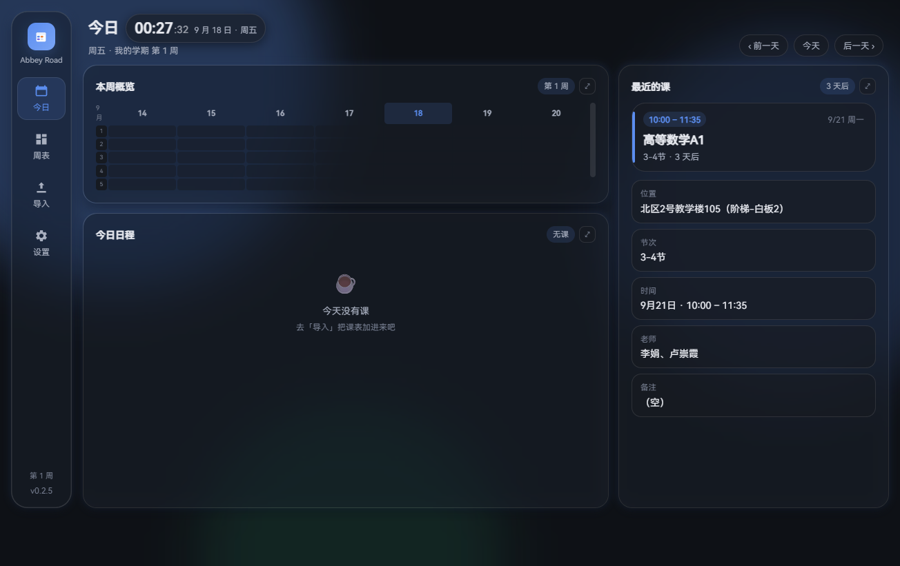
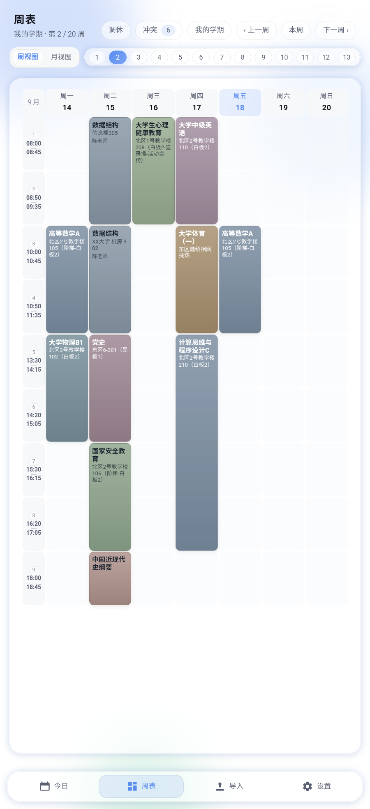
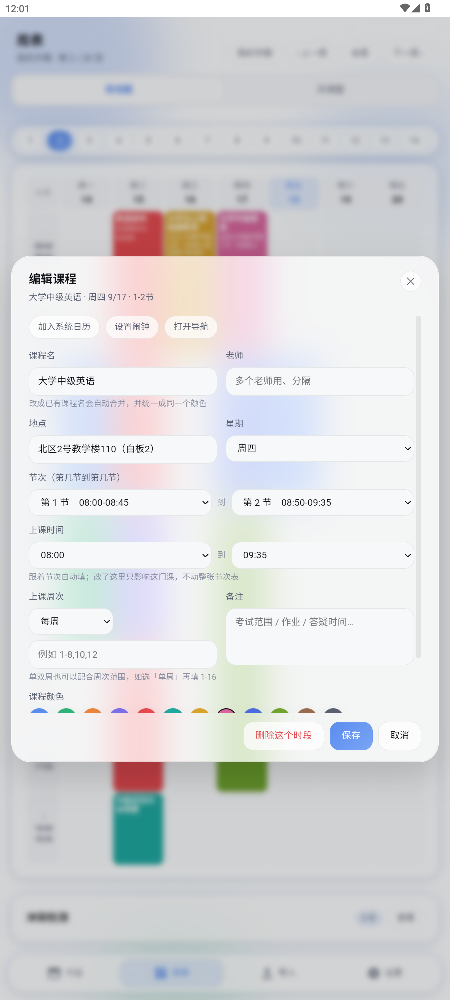
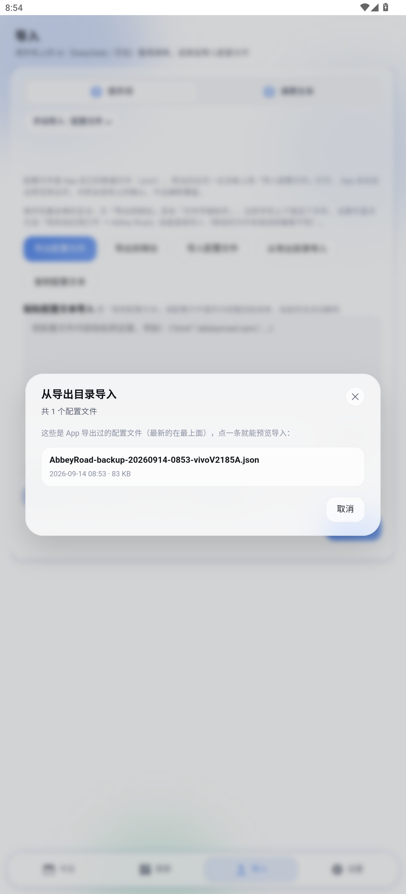
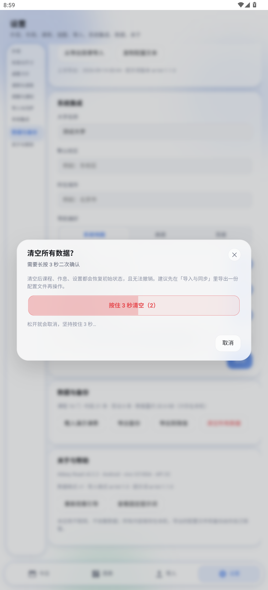

# Abbey Road · 大学生课表与日程


## 特性

- **今日一屏**：左「本周概览」、中「今日日程」、右「最近的课」，每一块点击都会**聚焦放大**看详情。
  放大时栏框做非线性补间（展开 380ms / 收起 330ms，`cubic-bezier(.18,1,.28,1)`），
  内容层则按最终尺寸先钉住再被"露出来" —— 文字既不拉伸也不重排，全程不抖。
  「最近的课」是焦点卡 + 6 个信息格（位置 / 节次 / 时间 / 老师 / 周次 / 备注），
  宽栏自动两列、窄屏一列，每一项都能点开直接改。
- **周表 / 月视图**：一整周课表（7 天日期在上、左侧是「第几节 + 几点到几点」），切周有方向感动画；
  可切换月视图看整月密度。
- **单节课程编辑**：周表里点任意课程块，就能改课程名、老师、地点、星期、节次、上课时间、
  单双周 / 周次范围、备注、颜色；「仅这次 / 所有时段」二选一，只改当天的那一节也不会影响其它周。
- **AI 排课表**：内置固定提示词，复制给 DeepSeek / 豆包，把课表截图交给它，再把结果粘回来即可
  （自定义 AR-TXT 文本格式，抗复制错乱）。
- **手动导入**：「手动导入」下分「手动添加」（课程 / 考试讲座活动）与「配置文件」（另一台设备导出的 JSON）。
- **配置同步**：导出配置文件 / **导出到微信**（Android 走系统分享，选微信就发文件）/
  复制配置文本 / 粘贴文本自动解析合并；微信里收到配置点「用其他应用打开 → Abbey Road」直接导入。
  跨设备按内容指纹合并，同一门课 id 不同也能对上，不会导出再导入变成两份。
  还有「**从导出目录导入**」：App 直接列出自己导出过的配置文件，点一条就导入，
  不依赖系统文件选择器（个别系统的选择器找不到文件也不影响）。
  导入后会自动把「当前学期」切到有课的那个（清空数据再导入也不会一片空白），
  并跳到今日页显示「已导入：课程 N 门 · 时段 M 条」。这块逻辑集中在
  `app/js/configio.js`（`AR.ConfigIO`）里，导出/导入/预览/合并各只有一份实现。
- **课次自动扩展**：导入的课表如果排到第 13 节甚至更晚，节次表会自动补足，
  这些课在周表和今日页都有正常时间，之后可以在设置里调。
- **默认作息**：12 节，08:00-08:45 / 08:50-09:35 / 10:00-10:45 / 10:50-11:35 /
  13:30-14:15 / 14:20-15:05 / 15:30-16:15 / 16:20-17:05 /
  18:00-18:45 / 18:50-19:35 / 19:40-20:25 / 20:30-22:00，可在设置里逐节改。
- **单双周 / 调课 / 停课 / 补课 / 换教室**：全部覆盖，冲突自动检测。
- **位置解析与导航**：自动去掉「305 教室」这类细节、补上大学名，一键跳高德 / 百度 / 系统地图。
- **系统集成**：把课程写进系统日历、设闹钟（OPPO / 一加 ColorOS 有专门的跳转链路）。
- **桌面卡片**（Android）：5 种小组件样式，不打开 App 也能看课表。
- **个性化**：深浅色 / 主题色 / 毛玻璃强度 / 动画速度 / 震动强度；「最近的课」按离上课时间自动变色
  （默认 15 分钟内红、30 分钟内黄、上课中蓝，阈值与颜色都能改）。

## 截图

| 今日页 | 周表 | 单节课程编辑 |
| --- | --- | --- |
|  |  |  |

| 导入 | 设置 | Windows 端 |
| --- | --- | --- |
|  |  |  |

配置文件页（导出 / 导出到微信 / 粘贴自动解析）：


从导出目录导入（不依赖系统文件选择器）与清空数据的「按住 3 秒」确认：

| 从导出目录导入 | 按住 3 秒清空 |
| --- | --- |
|  |  |

## 技术架构

一套 Web 界面内核 + 两端原生外壳，界面与业务逻辑 100% 共用：

```
abbey-road/
├─ app/              ← 唯一界面实现（HTML/CSS/JS），Android 与 Windows 共用
│  ├─ index.html
│  ├─ css/           tokens.css（设计令牌）· app.css（布局与组件）
│  └─ js/            core(数据/课表计算) · mdparse(文本解析) · ui(布局/动画) · panels(导入/设置/引导) · bridge(平台桥)
├─ android/          ← Android 外壳：Java + WebView + ARBridge（震动 / 日历 / 闹钟 / 地图 / 文件）
├─ windows/          ← Windows 外壳：C# + WebView2 + 原生桥 + 自研安装器
├─ tools/            ← 开发脚本（逻辑回归测试、CDP 驱动、逐帧抓图、窗口抓取）
└─ docs/screenshots/ ← 截图
```

- **为什么不是 Flutter**：本项目起步环境里只有 JDK + Android SDK，Flutter Windows 桌面还需要 VS C++ 工作负载；
  改用「Web 内核 + 原生外壳」后双端观感天然一致，规则与用例也能被将来的任意原生实现复用。
- **动效**：遵守一份《动效与光效实现规格书》——统一 6 条非线性缓动曲线，
  弹窗 300ms 进 / 200ms 出（全部由同一段 JS 驱动，抓 `getAnimations()` 比对参数保证一致），
  区块 60ms 错峰入场；今日页聚焦放大补间 `left/top/width/height` 真实几何，
  毛玻璃单独一层、动画期间尺寸冻结（模糊只算一次），所以既不变形也不掉帧。
- **过渡动画可自选（隐藏开发者模式）**：长按设置里的「外观」800ms 进入，
  5 个场景（今日页聚焦放大/缩小、卡片内容、弹窗进/出、页面入场、列表入场）共 50 种样式可选
  （含磁贴翻转、折纸展开、景深推移、点击处扩散、共享轴推进等）。
  **进和出是同一个选项的两个方向**，所以进出永远连贯；每个场景都能「试放」，
  也能一键恢复默认。默认：今日页=点击处扩散+回弹放大、弹窗=内容逐条拼合、页面切换=错峰上浮。
  磁贴翻转会**以你点的位置那条边为轴**翻进来。实现见 `app/js/motion.js`。
- **调休 / 借课**：把某一天的课整体**搬到**或**复制到**另一天，执行前有预览
  （几节课、哪些课、目标日会不会撞课）；记录为"单次改动"，不动课程模板。
- **周表长按空白处**：480ms 长按任意空档即可快速新增课程 / 考试讲座，星期与节次已预填。
- **课程配色方案**：经典彩色 / 文理分科 / 学术冷调 / 暖阳 / 高对比五套，
  按课程名自动识别理科—蓝青、文科—红紫、公共—绿、体育—橙，水课可手动指定为低饱和灰蓝；
  一键重排后同类型共用色系、深浅区分，白字始终清晰。取色器为自绘
  （饱和/明度方块 + 色相条 + 十六进制 + 最近使用），见 `app/js/palette.js`。
- **多尺寸自适应**：栏间距 10/12/14px、右栏 196px 下限按视口自动调；
  卡片按**每一栏自己的内容宽度**分 `w-xs…w-xl` 五档调字号与列数
  （直板机一列铺满、折叠屏/平板两列、超宽四列），窄到 100px 也不出现"一个字一行"。


## 数据与隐私

- 所有数据保存在设备本机（Android：WebView localStorage；Windows：`%LOCALAPPDATA%\Abbey Road`）。
- 应用**不发起任何网络请求**、不收集数据、没有账号体系；导出的文件由你自己保管。
- 配置文件是 JSON（`kind: "abbeyroad.sync"`），带 schema 版本号，导入前先预览、冲突逐条确认。

## 许可

MIT License，见 [LICENSE](LICENSE)。可以自由使用、修改、再发布，保留版权声明即可。
