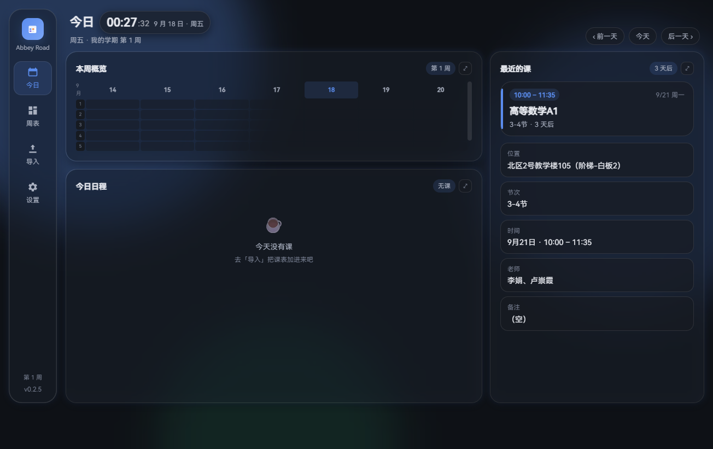
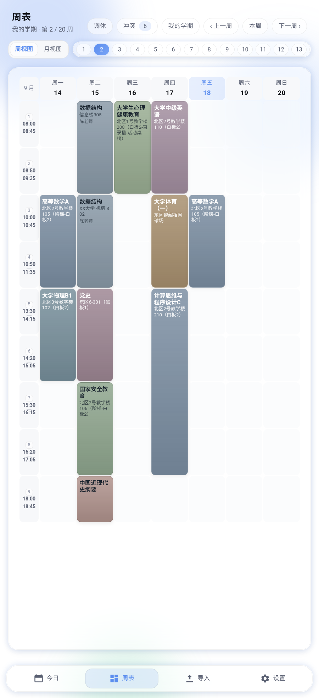
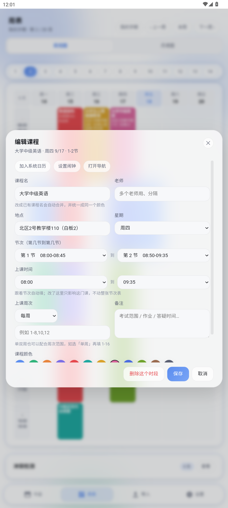
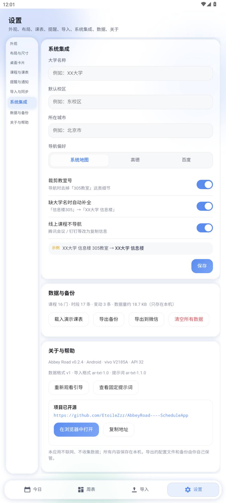

# Abbey Road

一个面向大学生的课表与日程管理工具。Android 与 Windows 两端，功能与界面一致，数据只保存在本机。

## 功能

- **今日**：本周概览、今日日程、最近的课三栏并列，每栏都可以点开放大看详情。
- **周表**：整周课表，左侧是节次与起止时间，可切换月视图。点任意课程即可修改课程名、老师、地点、星期、节次、上课时间、周次、备注和颜色。
- **排课规则**：支持单双周、周次范围、停课、补课、调课、换教室，冲突会提前提示。
- **导入**：把课表截图交给 DeepSeek、豆包等大模型，用应用内提供的固定提示词整理成文本，粘贴回来即可；也可以手动逐条添加，或导入另一台设备导出的配置文件。
- **同步**：导出配置文件后在另一台设备导入合并，导出文件可以经微信等渠道传递，不依赖账号和网络。
- **地点与系统**：地点会自动裁剪到教学楼一级再跳转高德、百度或系统地图；课程可以写入系统日历、设置闹钟。
- **个性化**：深浅色、主题色、毛玻璃强度、动画速度、震动反馈，以及多套课程配色方案。
- **桌面卡片**：Android 端提供若干种小组件样式。

## 截图

| 今日 | 周表 | 课程编辑 |
| --- | --- | --- |
|  |  |  |

| 导入 | 设置 | Windows |
| --- | --- | --- |
|  |  |  |

## 安装

- **Android**：从 [Releases](https://github.com/EtoileZzz/AbbeyRoad----ScheduleApp/releases) 下载 APK 安装，需要 Android 12 及以上。
- **Windows**：从同一页面下载安装程序，支持 Windows 10 和 11。

## 数据

数据保存在本机。应用不发起网络请求，不收集信息，也没有账号。

跨设备同步通过手动导入导出 JSON 配置文件完成，文件由使用者自己保管。导入前会先预览新增项与冲突项，确认后才合并。

## 从源码构建

界面代码在 `app/`，Android 与 Windows 外壳分别在 `android/` 和 `windows/`，两个目录下的 `build.ps1` 可以产出 APK 与安装程序。构建分别需要 JDK 17 与 Android SDK，以及 .NET Framework 与 WebView2 SDK。

## 贡献者

- EtoileZzz：项目作者，需求、设计与测试
- DeepSeek：代码实现

## 许可

MIT License，见 [LICENSE](LICENSE)。
